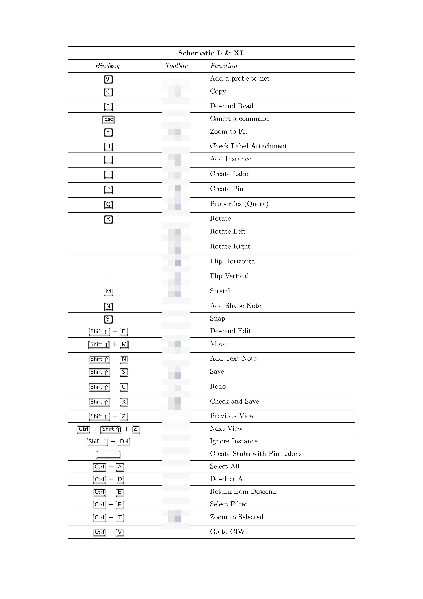

# cds-bindkeys

This repository contains a *TeX* file for creating a tabular 
list of some bindkeys (shortcuts) in *Cadence Virtuoso*, including
the corresponding toolbar-icons.

> [!NOTE]
> The bindkeys may vary for different Virtuoso installations.

The toolbars-icons, are not shipped in this repository 
(proprietary icons in the Virtuoso installation directory).
Please link the icons from Virtuoso installation directory
to the repository before compilation

```bash
ln -s `cds_root virtuoso`/share/cdssetup/icons
```

Afterwards, compile the Latex-File, e.g. using *pdflatex*

```bash
pdflatex cds-bindkeys.tex
```

Afterwards, a PDF is created. Please see below the first page of this PDF 
(toolbars-icons are blurred).


